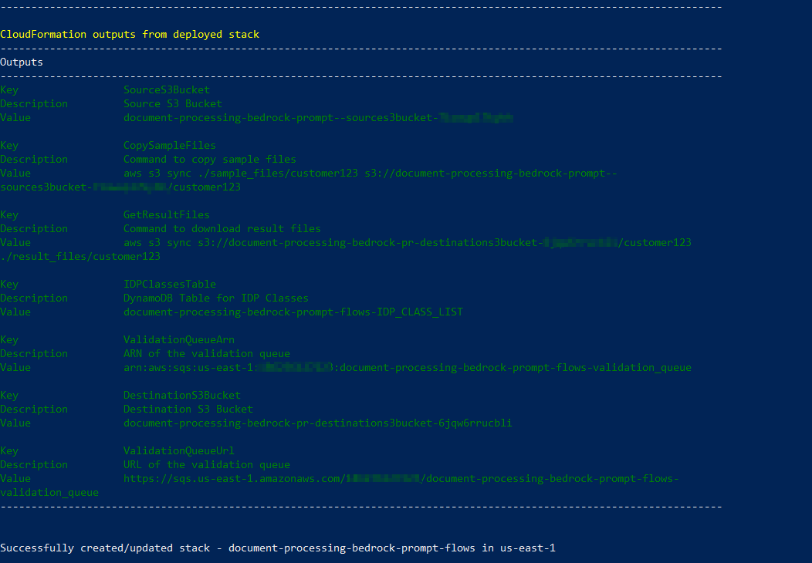
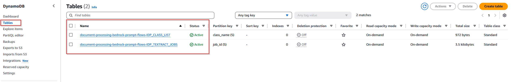
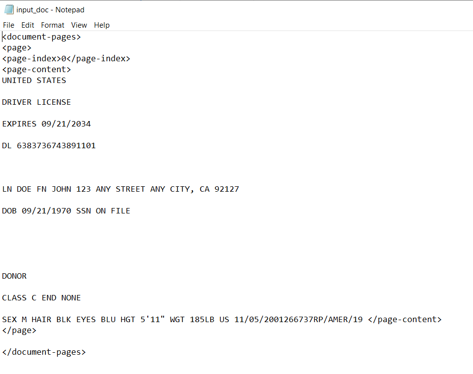
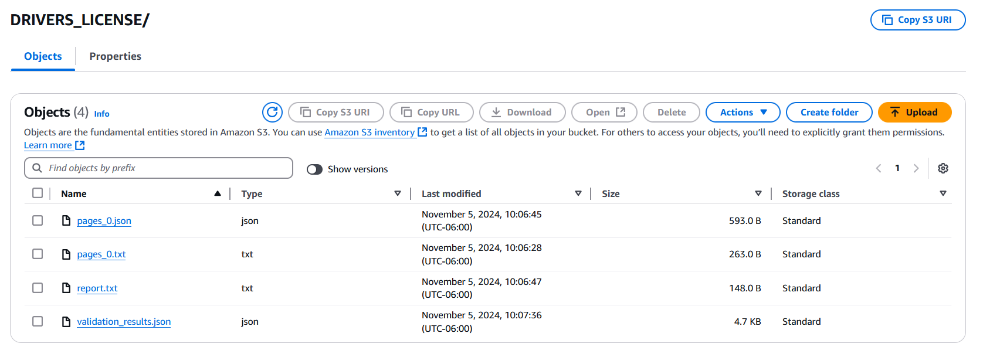
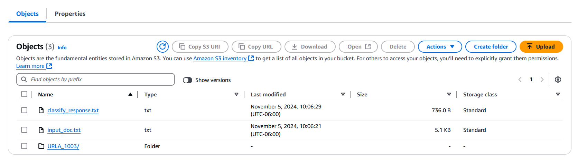

# Guidance for Intelligent Document Processing on AWS

## Table of Contents 

### Table of Contents

1. [Overview](#overview-required)
2. [Cost](#cost)
3. [Prerequisites](#prerequisites-required)
4. [Deployment Steps](#deployment-steps-required)
5. [Deployment Validation](#deployment-validation-required)
6. [Running the Guidance](#running-the-guidance-required)
7. [Next Steps](#next-steps-required)
8. [Cleanup](#cleanup-required)
8. [FAQ, known issues, additional considerations, and limitations](#faq-known-issues-additional-considerations-and-limitations-optional)
9. [Revisions](#revisions-optional)
10. [Notices](#notices-optional)
11. [Authors](#authors-optional)

## Overview
Every day, organizations receive high volumes of emails, forms, contracts, and other documents containing critical business information. Processing this unstructured data manually is a tedious, error-prone task that slows down key business workflows.
This guidance helps you automate document processing using a combination of AWS AI and machine learning services, including Amazon Textract, Amazon Bedrock, and Amazon A2I. By leveraging Intelligent Document Processing (IDP) and Generative AI, you can extract and structure data from complex documents, improve processing accuracy and speed, and capture more insights than traditional methods.
Unlike past IDP solutions, this guidance is designed to work with a wide variety of document layouts and formats, with minimal upfront customization required. It utilizes prompts and flows in Amazon Bedrock to seamlessly integrate foundation models, AI services, and AWS infrastructure, enabling the solution to scale horizontally to support multiple use cases.

Key benefits of this IDP guidance include:
- Automated document ingestion, classification, and data extraction
- Improved accuracy and processing times compared to manual methods
- Ability to handle complex, variable document formats
- Lower deployment and maintenance costs than previous commercial IDP solutions
- Scalable, serverless architecture that can adapt to evolving business needs

By implementing this guidance, your organization can focus on high-value tasks and decision-making, while AI and automation handle the heavy lifting of document processing.


## Cost 

You are responsible for the cost of the AWS services used while running this Guidance. As of October 2024, the cost for running this Guidance with the default settings in the US East Region is approximately $89 per month for processing  1,000 pages. 

We recommend creating a [Budget](https://docs.aws.amazon.com/cost-management/latest/userguide/budgets-managing-costs.html) through [AWS Cost Explorer](https://aws.amazon.com/aws-cost-management/aws-cost-explorer/) to help manage costs. Prices are subject to change. For full details, refer to the pricing webpage for each AWS service used in this Guidance.

### Sample Cost Table

The following table provides a sample cost breakdown for deploying this Guidance with the default parameters in the US East (N. Virginia) Region for one month, processing 1,000 documents.

| AWS service  | Dimensions | Cost [USD] |
| ----------- | ------------ | ------------ |
| Amazon Textract | 1,000 pages with Layouts (Analyze Document API)  | $ 4.00 |
| AWS Lambda | 3,000 requests per month on x86 with 512 MB ephemeral storage, 30s execution time | $ 0.19 |
| Amazon Simple Storage Service (S3) | S3 Standard storage (10 GB per month)| $ 0.24 month |
| Amazon Simple Notification Service (SNS) | Standard topics| $ 0.00 month |
| Amazon Simple Queue Service (SQS) | Standard topics| $ 0.00 month |
| Amazon Bedrock | Claude 3.5 Sonnet mooel with 4 million input tokens per month and 1 million output tokens) | $ 27.00 |
| Amazon A2I | 500 images per month with Augmented AI, 200 reviewed images with a Custom Model | $31.00 |
| Amazon DynamoDB | Standard Table class, size (1 GB) | $ 26.39 |

## Prerequisites

You will need an AWS account to use this solution. Sign up for an account [here](https://aws.amazon.com/resources/create-account/).

This guidance solutions uses serverless AWS services. You can use Linux/macOS to run commands from your local machine to deploy on your AWS account.

### Installing infrastructure tools

1. Clone the repo using command ```git clone https://github.com/aws-samples/aws-ai-intelligent-document-processing.git```
2. Install the AWS CLI following instructions [here](https://docs.aws.amazon.com/cli/latest/userguide/getting-started-install.html). 
3. Install the AWS SAM CLI following instructions [here](https://docs.aws.amazon.com/serverless-application-model/latest/developerguide/install-sam-cli.html).

### AWS account requirements

This guidance makes use of Anthropic's Claude-3.5 Sonnet Large Language Model (LLM). Your account must have access to this LLM in the region you have selcted to deploy this guidance. Please see instructions [here](https://docs.aws.amazon.com/bedrock/latest/userguide/model-access-modify.html) to add access to Amazon Bedrock foundation models. 

### Service limits

Your AWS account has default quotas, also known as service limits, described [here](https://docs.aws.amazon.com/general/latest/gr/aws_service_limits.html). This guidance can be installed and tested within the default quotas for each of the services used. You can request increases for some quotas. Note that not all quotas can be increased.

To operate this guidance at scale, it is important to monitor your usage of AWS services and configure alarm settings to notify you when a quota is close to being exceeded. You can find details on visualizing your service quotas and setting alarms [here](https://docs.aws.amazon.com/AmazonCloudWatch/latest/monitoring/CloudWatch-Quotas-Visualize-Alarms.html).  

### Supported Regions 

Deploy this guidance only in AWS regions that support Amazon Textract, Amazon Bedrock, and other aforementioned services in the architecture diagram.

## Deployment Steps

1. Make sure you have completed the predeployments steps outlined earlier. 
2. Navigate to the folder that contains the solution

```bash
cd guidance
```
3. Install the solution

```bash
chmod +x deploy.sh
./deploy.sh
```


## Deployment Validation

1. Open CloudFormation console and verify the status of the template with the name starting with document-guidance-for-idp-on-aws.

Note the names of these s3 buckets created by CloudFormation: SourceS3Bucket and DestinationS3Bucket.

**Examples:**

* If deployment is successful, you should see an active tables with the name starting with <document_> in DynamoDB. 



* Run the following CLI command to validate the deployment: ```aws cloudformation describe YOUR_STACK_NAME```

## Running the Guidance

This guidance includes sample files. We validate the Guidance by uploading sample files that match the same customer named John Doe (Driver's License and Uniform Residential Loan Application, or URLA) to the source S3 bucket, and validating the expected results from the destination s3 bucket. 

1. Upload sample documents to the created S3 source bucket. You can copy the command directly from your CloudFormation Outputs above with Key name CopySampleFiles:

```bash
aws s3 sync ./sample_files/customer123 s3://[SourceS3Bucket_NAME]/customer123
```

2. Download results from the destination S3 bucket after a few minutes to inspect the output files. You can copy the command directly from your CloudFormation Outputs above with Key name GetResultFiles:

```bash
aws s3 sync s3://[DestinationS3Bucket_NAME]/customer123 ./result_files/customer123 
```
Navigate to your S3 destination bucket. 


You should see a folder named customer123 that will contain 2 folders. 
First folder contains 3 objects related to Driver's License:
1. Drivers License information that was extracted with Amazon Textract from the source bucket we uploaded named input_doc.txt




2. classify_response.txt file contains the json output from our LLM


3. Folder named DRIVERS_LICENSE contains 4 objects in JSON. Check out each JSON to familiarize




Second folder contains 3 objects related to URLA:



1. classify_response.txt contains the json output from our LLM


2. input_doc.txt contains URLA information that was extracted with Amazon Textract from the source bucket we uploaded  
3. Folder named URLA_1003 contains 4 objects in JSON. Check out each JSON 

**Understanding the Validation Results for both folders**

The validation_results.json files contain the output from your document processing workflow. Each file represents a document that has undergone automated validation checks, with the following key details:
- Document Type: The type of document being processed, such as "URLA" (Uniform Residential Loan Application) or "DRIVERS_LICENSE".
- Validation Status: Indicates whether the document passed or failed the validation checks.
- Validation Checks: Lists the individual checks performed, such as schema validation, name matching, address matching, etc. Each check shows whether it passed or failed, along with a message.
- Schema Validation: Indicates if the document structure passed or failed validation against a predefined schema.
- Needs Manual Review: A flag indicating if the document requires human review based on the validation results.
- Case ID: A unique identifier for the document/customer.
- Original Document Location: The S3 bucket and key where the original document is stored.
- Timestamp: The timestamp when the validation was performed.

**DynamoDB tables**
Now navigate to DynamoDB table called `document-processing-bedrock-prompt-flows-IDP_TEXTRACT_JOBS`containing Textract jobs


`document-processing-bedrock-prompt-flows-IDP_CLASS_LIST` table contains a list of document classification classes


### **Lambdas:**

The `s3_event_handler` Lambda function is the entry point of the document processing pipeline. It triggers when a document is uploaded to S3, extracts the case number from the object key, and initiates an asynchronous Amazon Textract job with the `LAYOUT` feature for document analysis. It also sets up an SNS notification for when Textract completes its analysis and saves the job information (job_id, case_number, object_key, bucket_name, processed_date) to DynamoDB for tracking.

The `doc_classification_flow_handler` Lambda function processes Textract results and manages document classification. It is triggered by an SQS message when Textract completes analysis. This function extracts raw text from Textract results, organizing it by pages in XML format, and retrieves a list of supported document classes from DynamoDB. It then invokes the first Bedrock Agent flow (classification) with the raw document text and list of supported classes as input, producing a document classification and page mapping as output. The function saves results back to S3, including the raw document text, classification results, and individual text files for each classified section. It also creates processing instructions for the next step and sends them to an output SQS queue. This Lambda contains the first of the four prompt flows (classification flow).
 
The `doc_analysis_flow_handler` Lambda function processes documents based on their classification. Triggered by SQS messages from the classification Lambda, it handles each classified document section by retrieving the corresponding Bedrock Agent flow ID and alias (based on document type), adding metadata (such as `case_id` and `date`), and invoking the appropriate Bedrock flow for document analysis or extraction. The analysis results are then saved to S3. After all documents are processed, the function scans for generated JSON files and sends each to a validation queue for review. Each validation message includes the `case_id`, `document_type`, processed data, and S3 locations (for JSON and source text). This Lambda contains multiple prompt flows, one for each document type, to analyze and extract information.

The `doc_validation_lambda_handler` Lambda function manages document validation and the Amazon A2I (Augmented AI) workflow. Triggered by SQS messages from the analysis Lambda, it processes each document by identifying its type (e.g., DRIVERS_LICENSE, URLA) and performing validation in two steps: schema validation, which checks if the extracted data matches the expected format, and content validation, which validates the data against reference information (such as matching names, SSN, and addresses). The A2I process is triggered if schema validation fails, content validation fails (e.g., due to mismatched reference data), the document type is unknown, or system errors occur. The function saves validation results to S3, including the overall validation status, individual validation checks, indication of whether manual review is needed, original document locations, and timestamps.


So to summarize the 4 prompt flows across the Lambdas:
- Classification flow: Determines document type and page mapping
- Analysis flows: Document-specific extraction based on type (Driver's License, URLA)
- Validation flow: Checks extracted data against schemas and reference data
- Human Review (A2I): Triggers when validation thresholds aren't met

### **JSON flows**

The `idp_bank_statement_flow.json`extracts structured data from bank statements. It takes the document location, retrieves the text from S3, processes the text with `BankStatementToJsonPrompt`, and outputs structured JSON data.
Flow: Input → S3 Retrieval → Prompt Processing → JSON Output

The `idp_classify_flow.json` classifies the document type. It takes the document text and a class list, uses `ClassifyPrompt` for document classification, and returns the classification result.  
Flow: Input → Classification Prompt → Output

The `idp_drivers_license_flow.json` processes driver's license documents. It retrieves text from S3, uses `DriversLicenseToJsonPrompt` for extraction, and `DriversLicenseCheckPrompt` for validation. The results and analysis are saved to S3, including S3 locations.  
Flow: Input → S3 Retrieval → JSON Conversion → Storage  
Parallel: License Analysis with current date check

The `idp_for_review_flow.json` handles the document review process. It retrieves text from S3, uses `ForReviewPrompt` for analysis, and returns the review results.  
Flow: Input → S3 Retrieval → Review Analysis → Output

The `idp_urla_1003_flow.json` processes URLA (Uniform Residential Loan Application) documents. It retrieves text from S3, uses `URLAToJsonPrompt` for extraction, and `URLAAnalyzePrompt` for analysis. The results and analysis are saved to S3, including S3 locations.  
Flow: Input → S3 Retrieval → JSON Conversion → Storage  
Parallel: URLA Analysis


### **TXT prompts**

`idp_bank_statement_to_json_prompt.txt` extracts structured data from bank statements by taking bank statement text wrapped in `<STATEMENT>` tags as input and outputting a JSON file. This JSON includes account information (name, number, bank details), statement period, balance summary, transaction list, recurring transactions, fees and interest, and overdraft information.

`idp_classify_prompt.txt` classifies multi-page documents by taking document text with page indexes and a list of valid document classes as input. It groups sequential pages, matches each group to a class, and outputs a JSON array containing the document class and page indexes for each group. The result includes the thinking process and JSON in tags.

`idp_drivers_license_check_prompt.txt` validates driver's license expiration date against current date and returns "DOC_OK" or email for expired licenses.

`idp_drivers_license_to_json_prompt.txt` extracts standardized driver's license information from text into structured JSON format.

`idp_for_review_prompt.txt`identifies document type and creates a generic JSON template for any document of the same class.

`idp_urla_1003_analyze_prompts.txt` analyzes URLA/1003 mortgage applications to provide comprehensive assessment of applicant's financial status and loan eligibility.

`idp_urla_1003_to_json_prompt.txt` extracts comprehensive URLA/1003 mortgage application data into a detailed JSON structure covering applicant details, loan info, property, employment, income, assets, liabilities, and declarations.

`idp_urla1003prompt.txt` extracts banking information and transaction history from URLA/1003 mortgage applications to verify applicant's financial details.

`promptflows.yaml` This YAML defines the AWS CloudFormation resources for the Bedrock flows and prompts. This YAML ties together all the flow definitions and prompts we reviewed earlier into deployable AWS resources.

Key components:
1. IAM Role and Policies:
   - Allows Bedrock to access prompts, models, and S3

2. Five Main Flow Definitions:
   - Classification
   - Bank Statement
   - Driver's License
   - URLA/1003
   - Review

3. For each flow:
   - Prompt resource
   - Prompt version
   - Flow definition
   - Flow version
   - Flow alias 
   - Model configuration (tokens, temperature)

## **Setting up Amazon Augmented AI (A2I) for Document Processing**

Since current solution does not include the automated way of provisioning you A2I workforce, you'll need to set it up yourself. You can refer to the AWS [whitepaper](https://docs.aws.amazon.com/sagemaker/latest/dg/a2i-create-flow-definition.html/). The key steps are to set up the `Custom Workflow`, configure the human review workflow in A2I, and then integrate the workflow into your existing document processing solution

Here is a high-level overview of the process:
- Create a Private Work Team: Follow the instructions in the Create a private work team section of the blog post to set up a private work team for your reviewers.
- Create a Human Review Workflow: Refer to the Create a human review workflow section to configure your human review workflow in A2I. This will define the review process, instructions, and other settings.
- Update Your Solution with the Human Review Workflow: Once you have the human review workflow set up, follow the steps in the Update the solution with the human review workflow section to integrate the workflow into your existing document processing solution.
- Trigger the Human Review: When your document processing workflow identifies a document that needs manual review (based on the needs_manual_review flag in the validation_results.json), trigger the A2I human review workflow. This can be done by calling the appropriate AWS SDK or API operation from your application.
- Handle the Human Review Outcomes: Once the human review is completed, your application should retrieve the updated validation results from the A2I workflow and update the status of the document accordingly.

## Next Steps

**Integration with External Systems**
The document processing solution can be easily integrated with a variety of external business systems to create a more seamless and efficient workflow. Customers may wish to connect the solution to their existing CRM, ERP, or content management platforms to enable data sharing and a unified user experience.

**Multilingual Support**
To accommodate customers operating in multilingual environments, the solution can be adjusted to handle  documents in various languages. Customers can configure the solution to automatically detect the language of the incoming documents and route them to the appropriate processing pipelines with services like Amazon Translate or Amazon Comprehend. For example, documents in English can be processed through the standard validation and extraction steps, while documents in Spanish or Mandarin Chinese can be automatically translated before further processing. Alternatively, customers can route documents to language-specific processing pipelines, leveraging natural language processing (NLP) models that are tailored for the target language.
By leveraging the multilingual capabilities, customers can expand the reach of their document processing solution and provide a consistent experience for users and stakeholders across diverse linguistic environments.

## Cleanup 

To remove all created resources:

1. S3 buckets have versioning enabled. [Empty](https://docs.aws.amazon.com/AmazonS3/latest/userguide/empty-bucket.html) the SourceS3Bucket and DestinationS3Bucket buckets including all versions

2. Run the cleanup script

```bash
chmod +x cleanup.sh
./cleanup.sh
```

## FAQ, known issues, additional considerations, and limitations 


**Known issues (optional)**

This solution will work on Linux/MacOS. Windows users may need additional configuration or use WSL/Git Bash instead

**Additional considerations**

When building your own Generative AI application, review and consider the [OWASP Top 10 for LLMs and Generative AI Apps](https://genai.owasp.org/llm-top-10/)


## Notices

The dataset utilized in this guidance consists entirely of synthetic data. This artificial data is designed to mimic real-world information but does not contain any actual personal or sensitive information.

*Customers are responsible for making their own independent assessment of the information in this Guidance. This Guidance: (a) is for informational purposes only, (b) represents AWS current product offerings and practices, which are subject to change without notice, and (c) does not create any commitments or assurances from AWS and its affiliates, suppliers or licensors. AWS products or services are provided “as is” without warranties, representations, or conditions of any kind, whether express or implied. AWS responsibilities and liabilities to its customers are controlled by AWS agreements, and this Guidance is not part of, nor does it modify, any agreement between AWS and its customers.*


## Authors 
- Conor Manton
- Erik Cordsen
- Ed Branch
- Irina Soy