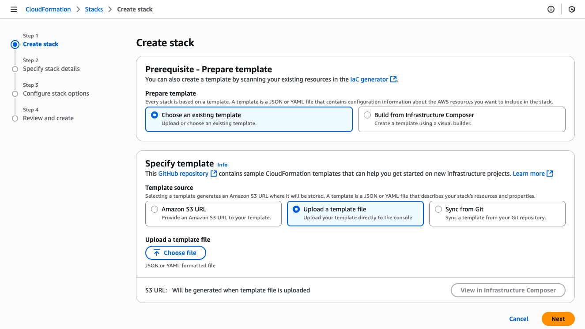
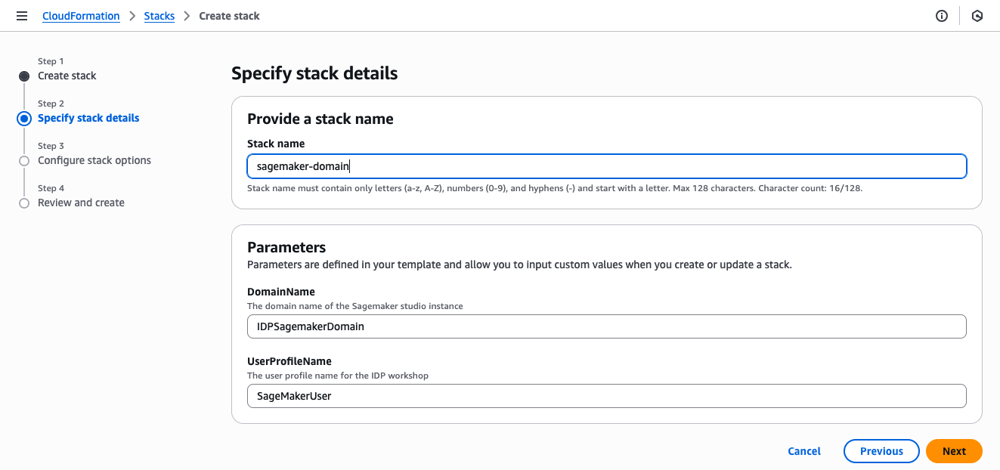
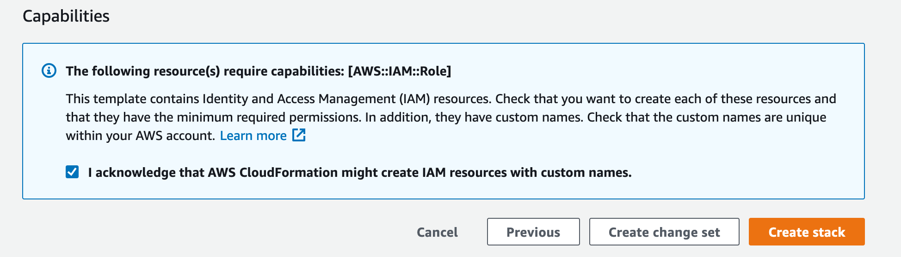
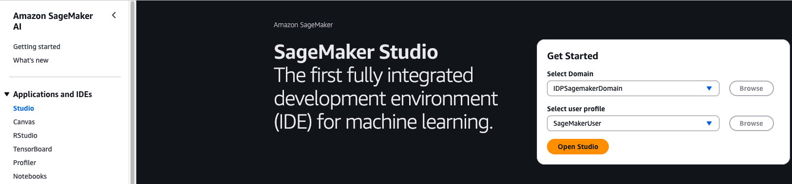
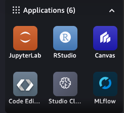
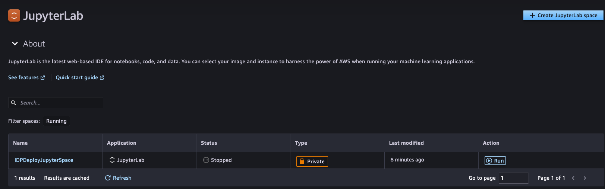

# Intelligent Document Processing with AWS AI Services

[](https://github.com/aws-samples/aws-ai-intelligent-document-processing/releases)
[](https://github.com/aws-samples/amazon-eks-arch-apache-solr/blob/main/LICENSE)

This repository is part of [Intelligent Document Processing with AWS AI Services](https://catalog.us-east-1.prod.workshops.aws/workshops/c2af04b2-54ab-4b3d-be73-c7dd39074b20) workshop.

Documents contain valuable information and come in various shapes and forms. In most cases, you are manually processing these documents which is time consuming, prone to error, and expensive. Not only do you want this information extracted quickly but you also want to automate business processes that presently rely on manual inputs and intervention across various file types and formats.

To help you overcome these challenges, AWS Machine Learning (ML) now provides you choices when it comes to extracting information from complex content in any document format such as insurance claims, mortgages, healthcare claims, contracts, and legal contracts.

## Different phases of Intelligent Document Processing pipeline

<p align="center">
  
</p>

In this workshop, we will deep-dive into each of these phases of the IDP Pipeline with solutions to automate each step.
We have hands-on labs to familiarize yourself with AWS AI services ( Amazon Textract, Amazon Comprehend) to build your solution

## Getting Started

In order to be able to execute all the Jupyter Notebooks in this sample, we will first need to create a SageMaker Studio domain. The CloudFormation template to create the SageMaker Studio domain and all the related resources, such as IAM Roles, S3 Bucket etc. is included under the `/dist` directory. Follow the steps below to create the CloudFormation stack using the `idp-deploy.yaml` file.

> :warning: Your AWS account **must have a default VPC** for this CloudFormation template to work.
> Your AWS account may incur some nominal charges for SageMaker Studio domain, Amazon Textract, and Amazon Comprehend. However, Amazon Textract, Comprehend, and SageMaker are free to try as part of [AWS Free Tier](https://aws.amazon.com/free/).

- Navigate to AWS Console
- Search for CloudFormation in the "Services" search bar
- Once in the CloudFormation console, click on the "Create Stack" button (use the "With new resources option")
- In the "Create Stack" wizard, chose "Template is ready", then select "Upload a template file"
<p align="center">
  
</p>

- Upload the [provided](./dist/idp-deploy.yaml) `yaml` file, click "Next"
- In the "Specify stack details" screen, enter "Stack name". Click "Next"
<p align="center">
  
</p>

- In the "Configure Stack options" screen, scroll down to the bottom of the page to the "Capabilities" section and acknowledge the notice that the stack is going to create required IAM Roles by checking the check box. Click "Next".
- In the "Review and create screen, leave the configurations as-is. Click "Submit"
<p align="center">
  
</p>

The stack creation can take upto 30 minutes. Once your SageMaker domain is created, you can navigate to the SageMaker AI console and click on "Studio" on the left pane of the screen. Choose the default user created "SageMakerUser" and Click on "Open Studio". This will open the SageMaker Studio IDE in a new browser tab. NOTE: If this is your first time using SageMaker Studio then it may take some time for the IDE to fully launch.

<p align="center">
  
</p>

## Setup SageMaker Studio

Once the SageMaker Studio IDE has fully loaded in your browser, you navigate to the JupyterLab Application in the top left of the IDE window:

<p align="center">
  
</p>

And then you can start the JupyterLab environment:

<p align="center">
  
</p>

During deployment, the repository is cloned automatically, but you can also clone manually if needed by using the following command in the JupyterLab terminal:

```
git clone https://github.com/aws-samples/aws-ai-intelligent-document-processing idp_workshop
```

Once the repository is cloned, a directory named `idp_workshop` will appear in the "File Browser" on the left panel of SageMaker Studio IDE

You can now access the Jupyter Notebooks inside the directory and start working on them. You're all set to begin the workshop!

## License

This library is licensed under the MIT-0 License. See the LICENSE file.
