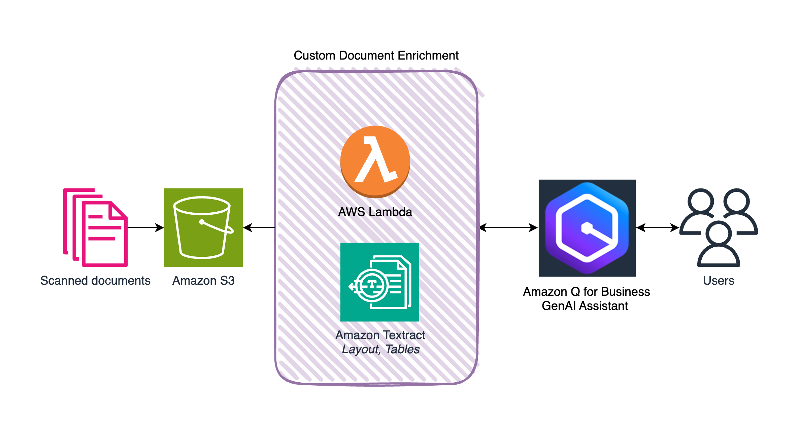
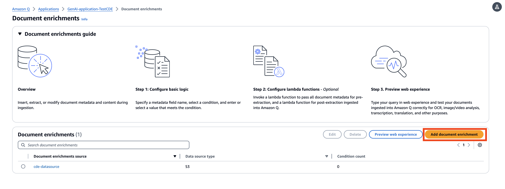
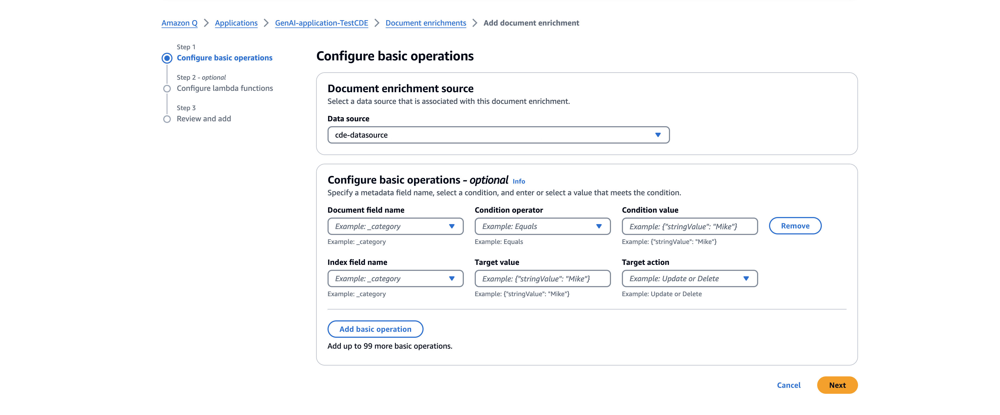
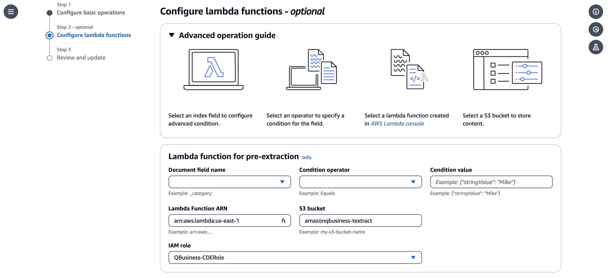

# Augment intelligent document processing workflows with Amazon Q 

## Overview:

[Amazon Q](https://aws.amazon.com/q/) is a generative AI–powered assistant that can answer questions and provide summaries based on the data and information provided to the knowledge base. 
However, one of its limitations has been the lack of support for scanned documents and images for its knowledge base. This is where Amazon Q’s custom document enrichment capability comes into play.
In this post, we walk you all through a custom integration between two AWS services: Amazon Textract and Amazon Q that alleviates your document processing workflows to leverage AI for enhanced internal knowledge management.

## Custom document enrichment (CDE) in Amazon Q:

The custom document enrichment feature in Amazon Q helps in controling both **what** documents and document attributes are ingested into your index and also **how** they're ingested. 
CDE enables you to create, modify, or delete document metadata and content when you ingest your documents into Amazon Q. 
Document enrichment offers two kinds of methods that you can use for your solution:

- **Basic operations**
- **Lambda functions**

We will be using the Lambda function method to prepare document attributes for advanced data manipulation using Amazon Textract.

## Solution Architecture:

The folllowing architecture explains the Amazon Q document ingestion workflow by configuring a pre-extraction Lambda function. Here, the custom document enrichment is an AWS lambda function that can pre-process the scanned documents and images. So when users upload documents to S3, the pre-extraction lambda function gets triggered and makes API calls to Amazon Textract *Layout* and *Tables*.

Amazon Textract [*Layout*](https://aws.amazon.com/about-aws/whats-new/2023/09/amazon-textract-layout-feature-extract-paragraphs-titles-documents/) and [*Tables*](https://aws.amazon.com/blogs/machine-learning/announcing-enhanced-table-extractions-with-amazon-textract/) FeatureTypes enable customers to go beyond simple text extraction as these FeatureTypes can understand the context and visual cues of the information in scanned documents, which is crucial for maintaining the relevance of responses provided by Amazon Q.

  

## Prerequisites:

To deploy the CDE solution in your AWS accounts, you will need the following setup: 

- Create Amazon Q application by following the steps mentioned in this [documentation](https://docs.aws.amazon.com/amazonq/latest/business-use-dg/create-app.html).
- For configuring the CDE using the pre-extraction Lambda function, you need an IAM role for `PreExtractionHookConfiguration` with permissions to run `PreExtractionHookConfiguration` and to access the Amazon S3 bucket when you use `PreExtractionHookConfiguration`. Add the role policy for `PreExtractionHookConfiguration` noted in this [documentation](https://docs.aws.amazon.com/amazonq/latest/business-use-dg/cde-lambda-operations.html#cde-lambda-operations-iam-roles:~:text=A%20role%20policy%20to%20allow%20Amazon%20Q%20to%20run%20PreExtractionHookConfiguration%20with%20encryption%20for%20your%20Amazon%20S3%20bucket.).
- Create an [Amazon Simple Storage Service](https://aws.amazon.com/s3/) (Amazon S3) bucket to use as a data source. Refer to [Amazon S3 User Guide](https://docs.aws.amazon.com/AmazonS3/latest/userguide/Welcome.html) for more information.
- Configure the above S3 bucket as a data source using the S3 data source connector in the Amazon Q application you created. The following [procedure](https://docs.aws.amazon.com/amazonq/latest/business-use-dg/s3-console.html) outlines how to connect Amazon Q to Amazon S3 using the AWS Management Console.

## Getting Started:

Before getting started, complete the above prerequisites.
Then, review the code for the [PreExtractionLambda](src/lambda/document_enrichment_cde.py) function that implements linearized text and tables a extraction from documents. You also need a Lambda Layer for adding PDF support using the [amazon-textract-textractor](https://aws-samples.github.io/amazon-textract-textractor/index.html) library. Follow the steps in this [documentation](https://aws-samples.github.io/amazon-textract-textractor/using_in_lambda.html) to add the Textractor Lambda Layer.
After the lambda function is deployed in your AWS account, you can configure the CDE as follows:

- On the Amazon Q console, choose your Applications in the navigation pane. 
- Choose your Amazon Q application that you created as a prerequisite under Applications section. 

  

- Choose Document enrichments under Enhancements section in the navigation pane.
- Click on the **Add document enrichment** button to configure .
- Select the data source that we created earlier in the prerequisites section and then Select **Next**.

  

- In the **Lambda function for pre-extraction** section, you need the ARNs of the `preExtraction` Lambda function. We use the same bucket that you’re using as the data source bucket.
- For IAM role, choose the CDE IAM role value we created in the prerequisite from the **Use the existing service role** dropdown and then Select **Next**.

  

- Choose **Add document enrichment.**

Voila! Now we’re ready to ingest scanned documents to our Amazon Q application! Once you sync your S3 data-source, your Amazon Q web experience is ready to be previewed, enhanced, and deployed.
